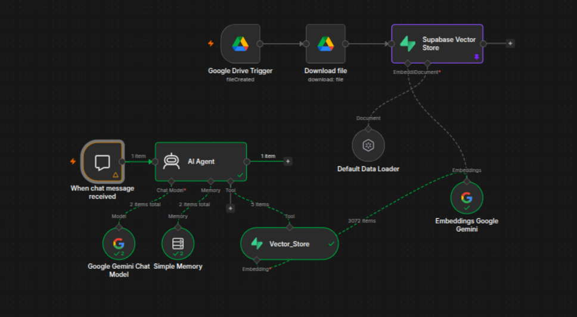
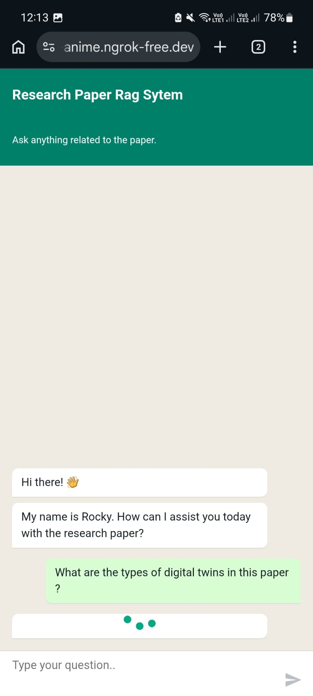
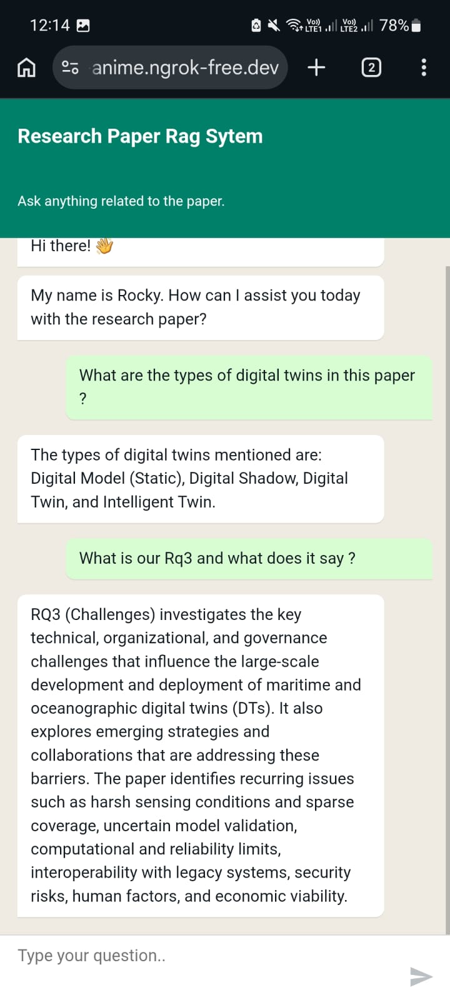

# AI RAG Agent

An end-to-end Retrieval-Augmented Generation (RAG) application that enables users to chat with their documents using Google's Gemini models, vector search, and n8n automation.

The system automatically ingests uploaded documents, generates embeddings, stores them in a vector database, and retrieves relevant context to produce grounded AI responses.

---

# Features

- Chat with PDFs and documents
- AI-powered Retrieval-Augmented Generation (RAG)
- Semantic vector search
- Automatic document indexing
- Conversational memory
- Google Drive document ingestion
- Web-based chat interface
- Fully automated workflow using n8n
- Supabase Vector Database
- Powered by Google Gemini

---

# Architecture

```
                Document Upload
                       │
                       ▼
               Google Drive Trigger
                       │
                       ▼
                Download Document
                       │
                       ▼
                Document Loader
                       │
                       ▼
             Gemini Embedding Model
                       │
                       ▼
            Supabase Vector Database


────────────────────────────────────────────

                 User Question
                       │
                       ▼
                 AI RAG Agent
                       │
                       ▼
           Retrieve Relevant Chunks
                       │
                       ▼
              Gemini Chat Model
                       │
                       ▼
                 Grounded Answer
```

---

# Tech Stack

- n8n
- Google Gemini 2.5 Flash Lite
- Gemini Embeddings
- Supabase (pgvector)
- Google Drive API
- Vector Search
- Retrieval-Augmented Generation (RAG)
- AI Agent
- Conversational Memory

---

# Workflow

## Document Ingestion

Whenever a document is uploaded to the configured Google Drive folder:

- Detect new file
- Download document
- Extract text
- Generate embeddings
- Store embeddings in Supabase

The document is immediately searchable.

---

## Question Answering

When a user asks a question:

1. Query is sent to the AI Agent
2. Relevant document chunks are retrieved
3. Retrieved context is passed to Gemini
4. AI generates a grounded response
5. Conversation history is maintained

---

# Example Questions

- Summarize this document.
- What are the key findings?
- Explain the methodology.
- What challenges are discussed?
- Give me a short overview.
- Compare two sections.
- What recommendations are provided?

---

# Screenshots

## Workflow



---

## Chat Interface

<p align="center">
  
</p>

---

## Example Conversation

<p align="center">
  
</p>

---

# Project Structure

```
AI-RAG-Agent/
│
├── README.md
├── LICENSE
├── .gitignore
│
├── workflow/
│   └── RAG_AI_Agent_Sanitized.json
│
├── screenshots/
    ├── workflow.png
    ├── chat.png
    └── query.png
```

---

# Getting Started

## 1. Clone Repository

```bash
git clone https://github.com/yourusername/AI-RAG-Agent.git
```

---

## 2. Import Workflow

Import the workflow into n8n.

```
workflow/RAG_AI_Agent.json
```

---

## 3. Configure Credentials

Replace placeholders with your own credentials:

- Google Drive OAuth
- Google Gemini API
- Supabase Database

---

## 4. Create Vector Table

Create a pgvector-enabled table in Supabase.

---

## 5. Upload Documents

Upload PDFs into the configured Google Drive folder.

The workflow automatically indexes them.

---

# Why RAG?

Unlike a traditional chatbot, this system retrieves relevant information from uploaded documents before generating a response. This improves factual accuracy, reduces hallucinations, and enables question answering over private knowledge bases.

---

# License

MIT
